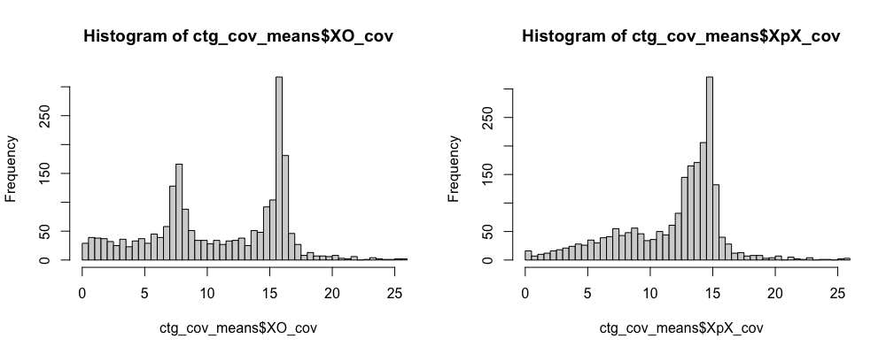
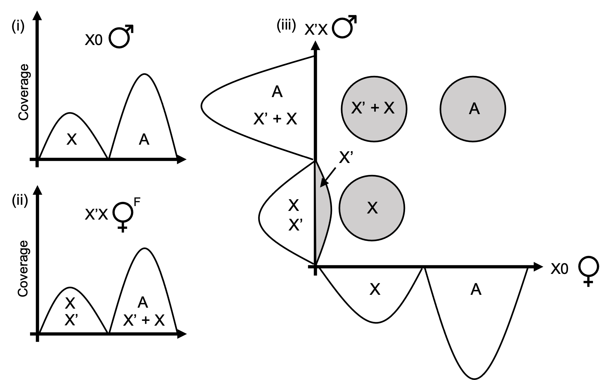
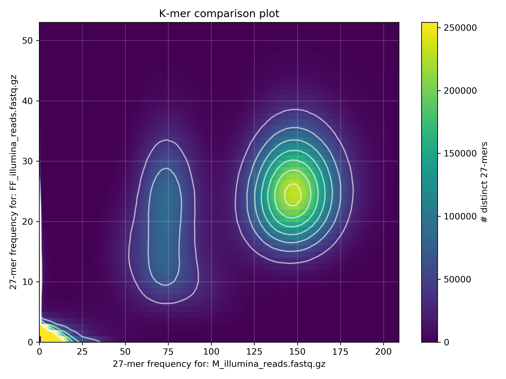
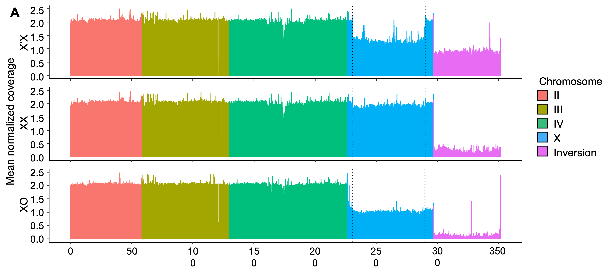

# Assembly and annotation of the X'

Software used:
- wtdbg2
- Canu
- Flye
- minimap2
- racon
- blobtools
- bwa
- blast
- diamond
- busco
- Seqtk
- KAT
- KMC
- Cookiecutter
- fastq-tools
- Spades
- ragtag
- BRAKER

## I. ASSEMBLY OF X'X PACBIO DATA

**Assembly**

I tried de novo assembly of the entire genome from PacBio (sequel 3.0, error-prone) data from X'X females in the hope that the X'-specific sequence would assemble separately (in hindsight, this was a long shot now knowing that the X and X' are very recently diverged). I tried the long-read assemlbers wtdbg2, fly and canu, assuming a genome size of about 320M (280ish plus 40-50ish corresponding to the inversion). Also, note this was all done prior to having access to HiC reads and the Bcop_v2 assembly.

Wtdbg2:
```
wtdbg2 -L 2500 -R -A --aln-dovetail -1 -x sq -t 20 -g 340m -i subreads.fastq -o redbean/H2FF_bcop_pb_L2500 &> redbean/H2FF_bcop_pb_L2500.log && wtdbg-cns -t 20 -i redbean/H2FF_bcop_pb_L2500.ctg.lay.gz -o redbean/H2FF_bcop_pb_L2500.ctg.fa
```

Flye:
```
flye --pacbio-raw subreads.fastq \
	--out-dir bcop.pb.flye \
	--genome-size 320m \
	--threads 60
```

Canu:
```
canu -correct \
	-p b_coprophila \
	-d bcop.pb.canu \
	genomesize=320m \
	-pacbio-raw subreads.fastq.gz \
	corOutCoverage=999 \
	corMhapSensitivity=low \
	useGrid=false
canu -trim \
	-p b_coprophila \
	-d bcop.pb.canu \
	genomeSize=320m \
	-pacbio-corrected b_coprophila.correctedReads.fasta.gz \
	useGrid=false
canu -assemble \
	-p b_coprophila \
	-d bcop.pb.canu \
	genomeSize=320m \
	-pacbio-corrected b_coprophila.trimmedReads.fasta.gz \
	useGrid=false 
```

| Assembler | Reads | Mb | N contigs | N50 (kb) | Largest ctg (kb)|
| ----------| ----- | -- | --------- | -------- | --------------- |
| wtdbg2 | raw >1000bp | 308 | 2395 | 349 | 2400 |
| wtdbg2 | raw >2500bp | 307 | 2382 | 353 | 2218 |
| wtdbg2 | canu-corrected | 221 | 8548 | 38 | 249 |
| flye | raw | 317 | 4642 | 290 | 2173 |
| canu | canu-corrected | 215 | 5800 | 55 | 304 |

Assembling with wtdbg2 with a read length cut-off of <2500bp seemed to yeild the best assembly in terms of overall length and contiguity.

**Polishing**

Polishing with PacBio and Illumina reads:

```
# prep Illumina reads for racon
cat LR43_EDSW200011440-1a_HJ5FNDSXY_L2_1.trimmed_paired.fq.gz LR43_EDSW200011440-1a_HJ5JVDSXY_L2_1.trimmed_paired.fq.gz > F_reads_1.fq.gz
cat LR43_EDSW200011440-1a_HJ5FNDSXY_L2_2.trimmed_paired.fq.gz LR43_EDSW200011440-1a_HJ5JVDSXY_L2_2.trimmed_paired.fq.gz > F_reads_2.fq.gz
cat F_reads_1.fq.gz F_reads_2.fq.gz > F_reads.combined.fastq.gz
zcat F_reads.combined.fastq.gz | tr -d " .*" | seqtk rename - F_reads. | awk '{print (NR%4 == 1 && NR%8 != 1) ? $0 ".2" : $0}' | awk '{print (NR%8 == 1) ? $0 ".1" : $0}' | gzip -c > F_reads.renamed.fastq.gz


# polish x2 with pb
minimap2 -t 60 -c -x map-pb bcop_pb_denovo.fasta subreads.fastq -o pb_vs_bcop_pb_denovo.1.ctg.paf && racon -t 60 --include-unpolished --no-trimming subreads.fastq pb_vs_bcop_pb_denovo.1.ctg.paf bcop_pb_denovo.fasta > bcop_pb_denovo.pb1.fasta
minimap2 -t 60 -c -x map-pb bcop_pb_denovo.pb1.fasta subreads.fastq -o pb_vs_bcop_pb_denovo.2.ctg.paf && racon -t 60 --include-unpolished --no-trimming subreads.fastq pb_vs_bcop_pb_denovo.2.ctg.paf bcop_pb_denovo.pb1.fasta > bcop_pb_denovo.pb2.fasta
# polish x3 with illumina
minimap2 -t 60 -x sr bcop_pb_denovo.pb2.fasta F_reads.renamed.fastq.gz > illum_vs_bcop_pb_denovo.1.ctg.paf && racon -t 60 --include-unpolished --no-trimming F_reads.renamed.fastq.gz illum_vs_bcop_pb_denovo.1.ctg.paf bcop_pb_denovo.pb2.fasta > bcop_pb_denovo.pb2.i1.fasta
minimap2 -t 60 -x sr bcop_pb_denovo.pb2.i1.fasta F_reads.renamed.fastq.gz > illum_vs_bcop_pb_denovo.2.ctg.paf && racon -t 60 --include-unpolished --no-trimming F_reads.renamed.fastq.gz illum_vs_bcop_pb_denovo.2.ctg.paf bcop_pb_denovo.pb2.i1.fasta > bcop_pb_denovo.pb2.i2.fasta
minimap2 -t 60 -x sr bcop_pb_denovo.pb2.i2.fasta F_reads.renamed.fastq.gz > illum_vs_bcop_pb_denovo.3.ctg.paf && racon -t 60 --include-unpolished --no-trimming F_reads.renamed.fastq.gz illum_vs_bcop_pb_denovo.3.ctg.paf bcop_pb_denovo.pb2.i2.fasta > bcop_pb_denovo.pb2.i3.fasta
```
```
stats for bcop_pb_denovo.pb2.i3.fasta
sum = 293442819, n = 2382, ave = 123191.78, largest = 2141892
N50 = 339249, n = 237
N_count = 12
Gaps = 12
```

**Decontamination with blobtools**

```
# map reads
minimap2 -t 40 -ax sr bcop_pb_denovo.pb2.i3.fasta H2FF_reads.combined.renamed.fastq.gz | samtools sort -@40 -O BAM -o bcop_ff_illum_reads_vs_Bcop_raw_blob.bam && samtools index bcop_ff_illum_reads_vs_Bcop_raw_blob.bam
# Homology searches (blast and diamond)
blastn -num_threads 30 -max_target_seqs 10 -max_hsps 1 -db nt.fa -evalue 1e-25 -outfmt '6 qseqid staxids bitscore std' -query bcop_pb_denovo.pb2.i3.fasta -out Bcop_raw.vs.ncbi_2019_09.nt.mts10.out
diamond blastx --threads 30 --db /ceph/software/databases/uniprot_2018_04/full/reference_proteomes.dmnd --sensitive --max-target-seqs 1 --evalue 1e-25 --outfmt 6 qseqid staxids bitscore qseqid sseqid pident length mismatch gapopen qstart qend sstart send evalue bitscore --query bcop_pb_denovo.pb2.i3.fasta > Bcop_raw.vs.uniprot.out
# Making blobplots (conda env blobtools):
~/software/blobtools/blobtools create -i bcop_pb_denovo.pb2.i3.fasta -t Bcop_raw.vs.ncbi_2019_09.nt.mts10.out -t Bcop_raw.vs.uniprot.out -b bcop_ff_illum_reads_vs_Bcop_raw_blob.bam -o Bcop_raw && ~/software/blobtools/blobtools view -i Bcop_raw.blobDB.json && ~/software/blobtools/blobtools plot -i Bcop_raw.blobDB.json
```

Analyse output in R:
```
# filter out metazoan contigs (for keeping)
contigs.animals <- contigs.bestsum[(contigs.bestsum$phylum == 'Arthropoda' | contigs.bestsum$phylum == 'Brachiopoda' | contigs.bestsum$phylum == 'Chordata' | contigs.bestsum$phylum == 'Cnidaria' | contigs.bestsum$phylum == 'Echinodermata' | contigs.bestsum$phylum == 'Mollusca' | contigs.bestsum$phylum == 'Nematoda' | contigs.bestsum$phylum == 'Porifera' | contigs.bestsum$phylum == 'Rotifera'),]
# filter out no hit contigs (also for keeping)
contigs.no.hit <- contigs.bestsum[(contigs.bestsum$phylum == 'no-hit'),]
# combine metazoans + no hits
contigs.animals.no.hit <- rbind(contigs.animals,contigs.no.hit)
contigs.other <- anti_join(contigs.bestsum,contigs.animals.no.hit,by='contig')
# include contigs that had a strong 2nd hit to arthopods
contigs.other.arthropoda.2nd <- contigs.other[grepl('Arthropoda', contigs.other$phylum_hits),]
contigs.animals.no.hit.other.arthropoda.2nd <- rbind(contigs.animals.no.hit,contigs.other.arthropoda.2nd)
# only include contigs greater than 1kb in length
scop.contigs.keep <- contigs.animals.no.hit.other.arthropoda.2nd[(contigs.animals.no.hit.other.arthropoda.2nd$len > 1000) & (contigs.animals.no.hit.other.arthropoda.2nd$cov > 2),]
```

After removing contaminants (non-arthropod sequences, <1kb and <2 cov ctgs)...
```
seqtk subseq /data/ross/flies/analyses/bradysia_sex_determination/001_genome_assembly/results/1_gynogenic_female_assembly/polish_rerun/bcop_pb_denovo.pb2.i3.fasta bcop_contig_keep_list.txt > bcop_pb_denovo.rmcontam.fasta
```
stats for bcop_pb_denovo.rmcontam.fasta
sum = 291626436, n = 2246, ave = 129842.58, largest = 2141892
N50 = 342355, n = 234
N_count = 12
Gaps = 12

Final BUSCO score:

        --------------------------------------------------
        |Results from dataset insecta_odb10               |
        --------------------------------------------------
        |C:96.9%[S:93.5%,D:3.4%],F:1.0%,M:2.1%,n:1367     |
        |1324   Complete BUSCOs (C)                       |
        |1278   Complete and single-copy BUSCOs (S)       |
        |46     Complete and duplicated BUSCOs (D)        |
        |14     Fragmented BUSCOs (F)                     |
        |29     Missing BUSCOs (M)                        |
        |1367   Total BUSCO groups searched               |
        --------------------------------------------------


**Chromosome assignment**

I'm mapping XpX and X0 reads and using coverage to assign reads to chromosomes. The expectation is that autosomal scaffolds should have diploid (2n) coverage for both XpX and X0 reads. The ends of the X shared by X and X' should also have 2n coverage. The portion of the X homologous to the X' inversion should have haploid (1n) coverage in both sexes. The X' inversion should have 1n coverage in XpX females and close to zero coverage in males.

```
# map reads
bwa index bcop_ff.unscaf.fa
bwa mem -t 32 -p bcop_ff.unscaf.fa F_reads_1.fq.gz F_reads_2.fq.gz | samtools view -b - > F_v_bcop_ff_unscaf.bam && samtools sort -@ 32 -o F_v_bcop_ff_unscaf.sorted.bam F_v_bcop_ff_unscaf.bam
bwa mem -t 32 -p bcop_ff.unscaf.fa 180608_A00291_0042_BH3CC3DRXX_2_11372RL0006L01_1.trimmed_paired.fq.gz 180608_A00291_0042_BH3CC3DRXX_2_11372RL0006L01_2.trimmed_paired.fq.gz | samtools view -b - > M_v_bcop_ff_unscaf.bam && samtools sort -@ 32 -o M_v_bcop_ff_unscaf.sorted.bam M_v_bcop_ff_unscaf.bam

# get coverage with bedtools
samtools index *.sorted.bam
bedtools genomecov -ibam F*.sorted.bam -d > per_base_cov_F.txt
bedtools genomecov -ibam M*.sorted.bam -d > per_base_cov_M.txt

# This script will calculate coverage means across scaffolds
Rscript ~/scripts/R_scripts/get_ctg_cov_means_2samples.R
# This script will get coverage means across 20kb sliding windows (for plotting)
Rscript ~/scripts/R_scripts/get_20kb_cov_win_means_2samples.R
```

Analyse the output of get_ctg_cov_means_2samples.R in R to assign contigs to chromosomes:

```
# Load in contig coverage means
XO_ctg_means <- read.table('ctg_cov_means_XO.txt', stringsAsFactors = FALSE, header=T)
XpX_ctg_means <- read.table('ctg_cov_means_XpX.txt', stringsAsFactors = FALSE, header=T)
ctg_cov_means <- merge(XO_ctg_means, XpX_ctg_means, by=c('id'))
colnames(ctg_cov_means) <- c('id', 'XO_cov', 'XpX_cov')
head(ctg_cov_means)

par(mfrow=c(1,2))
hist(ctg_cov_means$XO_cov,breaks=2000, xlim=c(0,25))
hist(ctg_cov_means$XpX_cov,breaks=2000, xlim=c(0,25))
# normalise coverage - diploid peak for X0 is about 16x, for XpX it's about 14x
ctg_cov_means$norm_XO <- ctg_cov_means$XO_cov/8
ctg_cov_means$norm_XpX <- ctg_cov_means$XpX_cov/7

# A scaffolds = x2 in both
# X scaffolds = x1 in males, x1 - x2 in females
# X' scaffolds = < x1 in males, x1 in females

A_scafs <- ctg_cov_means[which(ctg_cov_means$norm_XO>(1.5)),]
nrow(A_scafs) # 1123
X_scafs <- ctg_cov_means[which(ctg_cov_means$norm_XO<(1.5) & ctg_cov_means$norm_XO>(0.5)),]
nrow(X_scafs) # 864
Xp_scafs <- ctg_cov_means[which(ctg_cov_means$norm_XO<(0.5)),]
nrow(Xp_scafs) # 259

A_scafs <- A_scafs[,c(1)]
A_scafs <- as.data.frame(A_scafs)
colnames(A_scafs) <- c('id')
A_scafs$chrom <- "A"
X_scafs <- X_scafs[,c(1)]
X_scafs <- as.data.frame(X_scafs)
colnames(X_scafs) <- c('id')
X_scafs$chrom <- "X"
AX_scafs <- merge(A_scafs, X_scafs, by=c('id', 'chrom'), all=T)

scaf_ids <- merge(ctg_cov_means, AX_scafs, by=c('id'), all=T)
scaf_ids[is.na(scaf_ids)] <- 'Inversion'
head(scaf_ids)
nrow(scaf_ids)

# manually curate
write.table(scaf_ids, file="bcop_pb_denovo_scaf_cov.txt", sep="\t", quote=F, col.names=T, row.names=F) 

ctg_ids <- scaf_ids[,c(1,8)]

# load in contig lengths
ctg_lengths <- read.table('bcop_pb_denovo_ctg_lengths.txt', stringsAsFactors = FALSE, header=F)
colnames(ctg_lengths) <- c('id', 'len')
scaf_ids_len <- merge(scaf_ids, ctg_lengths, by=c('id'))
head(scaf_ids_len)
A <- scaf_ids_len[which(scaf_ids_len$chrom == "A"),]
sum(A$len) # 215155031
X <- scaf_ids_len[which(scaf_ids_len$chrom == "X"),]
sum(X$len) # 72842239
Inversion <- scaf_ids_len[which(scaf_ids_len$chrom == "Inversion"),]
sum(Inversion$len) # 3629166
```

The fact that the genome is only 292Mb is already an indication that the X' has not assembled independently of the X (the genome from X0 males is around this size, Urban et al. 2021). The coverage histograms support this, the haploid peak for XpX is really small (this will be X- and X'-specific sequence):



And the amount of sequence assigned to each chromosome (the size of the As + X are about right though):

| Chromosome | Bases assigned |
| - | - |
| Autosomes | 215155031 |
| X | 72842239 |
| Inversion | 3629166 |

My guess is that X and X' reads have collapsed upon assembly, which won't have been helped by the 10%+ PacBio read error rate. 

## II. K-MER-BASED READ FILTERING AND X' ASSEMBLY

Kamil had the idea to use k-mer frequency distributions to identify X'-specific k-mers.

Idea: k-mers specific to a particular chromosome (or chromosome region) might have different coverage dependent on their ploidy.

Since males are X0, X-linked k-mers should have half the coverage of autosome-linked k-mers. In inversion-carrying females, anything that is specific to only the X or X’ should have half the coverage of autosomes or k-mers shared by X’ and X.

If you were to plot the k-mer frequencies against each other, the k-mers should cluster in a pattern that would further elucidate their origin. This is demonstrated in the figure below



- Anything diploid/represented two-fold in both sexes clusters top-right
- Anything diploid in females but haploid in males (i.e. everything shared by X’ and X) c- lusters top-left
- Anything haploid in both clusters bottom-left
- Anything haploid in females and not present in males (i.e. inversion) clusters on y-axis.
- K-mers containing read errors (and will thus be of low frequency) will cluster at the origin

If I do this with X0 vs XpX reads, using KAT:

```
zcat 180608_A00291_0042_BH3CC3DRXX_2_11372RL0006L01_1.fastq.gz 180608_A00291_0042_BH3CC3DRXX_2_11372RL0006L01_2.fastq.gz > M_illumina_reads.fastq.gz
zcat LR43_EDSW200011440-1a_HJ5FNDSXY_L2_1.fq.gz LR43_EDSW200011440-1a_HJ5JVDSXY_L2_1.fq.gz LR43_EDSW200011440-1a_HJ5FNDSXY_L2_2.fq.gz LR43_EDSW200011440-1a_HJ5JVDSXY_L2_2.fq.gz > FF_illumina_reads.fastq.gz

kat comp -t 16 -n -o illum_M_vs_FF_heads M_illumina_reads.fastq.gz FF_illumina_reads.fastq.gz
```

This is indeed what we see:



**Pulling the X' k-mers and reads**

I used kmc to build a k-mer database for each set of trimmed reads: those from male soma and those from X'X female soma:

```
# males
mkdir tmp
ls *.fq.gz > FILES
kmc -k27 -t20 -m64 -ci5 -cs175 @FILES male_kmer_counts tmp/

# females
mkdir tmp
ls *.fq.gz > FILES
kmc -k27 -t20 -m64 -ci5 -cs175 @FILES female_kmer_counts tmp/
rsync -av female_kmer_counts* /data/ross/flies/results/b_coprophila/007_chromosome_assignment/kmer_analysis/kmc_counts
rm -r *
```
Then, also using kmc, I generated k-mer counts for each database:

```
kmc_tools transform male_kmer_counts -ci5 -cx174 dump -s male_k27.dump
kmc_tools transform female_kmer_counts -ci5 -cx174 dump -s female_k27.dump
```

I then used a series of python scripts (originally written by Kamil and edited by myself) to merge these k-mer counts and produce three fasta files containing the k-mer reads themselves: X'-specific k-mers, and also ones for the other two k-mer clouds in case I want them. For the X' k-mers I chose those that have a count of 0 in the male reads and a count of >5 in the female reads to exclude read error k-mers.

```
python3 merge_two_dumps.py male_k27.dump female_k27.dump > merged_k27.dump
python3 dump2fasta.py merged_k27.dump
```

The plan now is to use these 27-mers to fish out reads and assemble each chromosome separately. One option for k-mer based filtering of reads is to use Cookiecutter (https://github.com/ad3002/Cookiecutter), e.g.:

```
python2.7 /ceph/users/rbaird/software/cookiecutter_linux_x64.xzkLa3/bin/cookiecutter extract -1 reads_1.fq -2 reads_2.fq -f kmer_k27_Xp.lib.txt -o Xp_reads
```

I did this with all XpX read files (ours and John's), and about 6-8% of reads get pulled which sounds about right (the inversion should be about 50-60Mb of the 330-340Mb haploid genome).

If I try with long reads, only <1% of reads get pulled. This is almost certainly due to the high error rate. Maybe it's possible to tailor this by allowing for mismatches, but then I worry about pulling reads I don't want. I feel this approach would probably work well with HiFi reads, but unfortunately we don't have HiFi.

**Assembling the X' reads**

Cookiecutter outputs two files: .filtered.fastq and .se.fastq. The 'filtered' file contains reads that passed , the 'se' file contains reads whose mate passed. Since a pair of reads must come from the same chromosome, it makes sense to combine the files. After combining (with cat) you have to sort (e.g. with fastq-sort from fastq-tools). I then assembled all the putative X' reads with spades:

```
spades.py -t 16 --isolate --pe1-1 pe1_1.sorted.fastq --pe1-2 pe1_2.sorted.fastq --pe2-1 pe2_1.sorted.fastq --pe2-2 pe2_2.sorted.fastq --pe3-1 pe3_1.sorted.fastq --pe3-2 pe3_2.sorted.fastq --pe4-1 pe4_1.sorted.fastq --pe4-2 pe4_2.sorted.fastq -o W_assembly

# result:
sum = 61770347, n = 42564, ave = 1451.23, largest = 86953
N50 = 10324, n = 1573
N_count = 10288
Gaps = 376
```

Obviously this is really fragmented, so I'll scaffold against the X from the reference (Bcop_v2) to get some contiguity. This comes with the price that any X'-specific structural rearrangements will not be revealed, but it will still allow me to identify X'-X homologs which will be useful for downstream analysis.

```
ragtag.py correct -t 16 Bcop_v2-chromosomes_X.fasta scaffolds.fasta -o Xp_ragtag_correction
ragtag.py scaffold -t 16 Bcop_v2-chromosomes_X.fasta Xp_ragtag_correction/scaffolds.corrected.fasta -o Xp_ragtag_scaffolding

sum = 62695847, n = 33391, ave = 1877.63, largest = 52428113
N50 = 52428113, n = 1
N_count = 935788
Gaps = 9631
```

So 52.4Mb (51.5 without Ns) is assembled into one contig. The other 10Mb may be a combination of junk, duplicated portions of the X', or X'-specific sequence.

**Assembly curation**

I'm going to try to use the PacBio reads to gap-fill the above assembly since it's very fragmented. I'll do this by combining the inversion with the rest of the assembly (Bcop_v2) and mapping all reads against the entire assembly - assuming that most of the reads will map to their correct chromosome.

```
# combine:
cat Bcop_v2-chromosomes.fasta inversion.fasta > Bcop_v3-chromosomes.fasta
```

Polish:
```
# polish x2 with pb
minimap2 -t 60 -c -x map-pb Bcop_v3_chromosomes.fasta subreads.fastq -o pb_vs_v3.1.ctg.paf && racon -u --no-trimming -t 60 subreads.fastq pb_vs_v3.1.ctg.paf Bcop_v3_chromosomes.fasta > Bcop_v3_chromosomes.pb1.fasta
minimap2 -t 60 -c -x map-pb Bcop_v3_chromosomes.pb1.fasta subreads.fastq -o pb_vs_v3.2.ctg.paf && racon -u --no-trimming -t 60 subreads.fastq pb_vs_v3.2.ctg.paf Bcop_v3_chromosomes.pb1.fasta > Bcop_v3_chromosomes.pb2.fasta
# polish x2 with my illumina
minimap2 -t 60 -x sr Bcop_v3_chromosomes.pb2.fasta my_reads.renamed.fastq.gz > illum_vs_v3.1.ctg.paf && racon -u --no-trimming -t 60 my_reads.renamed.fastq.gz illum_vs_v3.1.ctg.paf Bcop_v3_chromosomes.pb2.fasta > Bcop_v3_chromosomes.pb2.i1.fasta
minimap2 -t 60 -x sr Bcop_v3_chromosomes.pb2.i1.fasta my_reads.renamed.fastq.gz > illum_vs_v3.2.ctg.paf && racon -u --no-trimming -t 60 my_reads.renamed.fastq.gz illum_vs_v3.2.ctg.paf Bcop_v3_chromosomes.pb2.i1.fasta > Bcop_v3_chromosomes.pb2.i2.fasta
# polish x2 with johns illumina
minimap2 -t 60 -x sr Bcop_v3_chromosomes.pb2.i2.fasta john_reads.renamed.fastq.gz > illum_vs_v3.3.ctg.paf && racon -u --no-trimming -t 60 john_reads.renamed.fastq.gz illum_vs_v3.3.ctg.paf Bcop_v3_chromosomes.pb2.i2.fasta > Bcop_v3_chromosomes.pb2.i3.fasta
minimap2 -t 60 -x sr Bcop_v3_chromosomes.pb2.i3.fasta john_reads.renamed.fastq.gz > illum_vs_v3.3.ctg.paf && racon -u --no-trimming -t 60 john_reads.renamed.fastq.gz illum_vs_v3.3.ctg.paf Bcop_v3_chromosomes.pb2.i3.fasta > Bcop_v3_chromosomes.pb2.i4.fasta

# assembly stats:
# pre-polish
sum = 52428113, n = 1, ave = 52428113.00, largest = 52428113
N_count = 932828
Gaps = 9409

# pacbio polish 1
sum = 54697758
N_count = 377438
Gaps = 3910

# pacbio polish 2
sum = 55167027
N_count = 344548
Gaps = 3487

# final (4th) illumina polish:
sum = 54744915
N_count = 344193
Gaps = 3486
```

So polishing with racon reduced the number of gaps from 9409 to 3487. Competitively mapping the short reads for polishing after has preumably helped to polish those gaps that were plugged. 

I pulled out this final scaffold and combined it with Bcop_v2 to make 'Bcop_v3'.

**Validating the assembly with coverage distributions**

To check for the correspondence of this scaffold to the X', I'll look at coverage of the three genotypes (X'X, XX, X0) against Bcop_v3. If this scaffold truly represents the X' inversion, coverage across it should be low for XX and X0, and they should have diploid and haploid coverage across the X respectively. X'X should show haploid coverage across the inversion and the portion of X homologous to the inversion. If the scaffold does not truly correspond to the inversion, then we should see similar coverage distributions between the X'X and XX samples.

Map samples:
```
bwa index Bcop_v3-chromosomes.fasta
for file in $(ls *.fq.gz)
do
	base=$(basename $file "_1.fq.gz")
	bwa mem Bcop_v3-chromosomes.fasta ${base}_1.fq.gz ${base}_2.fq.gz |\
	samtools view -b - > ${base}.bam \
	&& samtools sort -@ 8 -o ${base}.sorted.bam ${base}.bam
done
```

Use bedtools and a custom R script to get coverage distributions:
```
for file in $(ls *.bam)
do
	base=$(basename $file ".bam")
	samtools index ${base}.bam
	bedtools genomecov -ibam ${base}.bam -d > per_base_cov.txt
	Rscript ~/scripts/R_scripts/get_100kb_cov_win_mean.R
	mv 100kb_cov_win_means.txt ${base}.100kb.win.means.txt
done
```



## III. GENOME ANNOTATION

I'm using BRAKER2 for annotation. I'll map all RNAseq data we have available to the genome using STAR and feed the alignments to BRAKER2, along with homology-based datasets. I have tried to be as comprehensive as possible here.

The following RNAseq datasets will be used:
- Embryo (x3 reps each sex), larva (x2 reps each sex), pupa (x2 reps each sex, adult (x2 reps each sex)
- Somatic tissue (x3 reps each sex)
- Early (0-8h) embryos (x6 reps each sex)
- 15 RNAseq datasets from various salivary gland stages
- 6 datasets from control and radiated larval stages

The following homology datasets will be used:
- Uniprot Diptera protein sequences - 7053 sequences
- Orthodb_v10 Diptera protein sequences - 751660 sequences
- Refseq diptera protein sequences (+ all non-canonical isoforms - 1.5m sequences)

The Orthodb dataset was downloaded from downloaded from here: https://www.orthodb.org/?page=filelist and Diptera proteins were extracted like so:
```
zcat odb10v1_OG2genes.tab.gz | awk '$1 ~ /7147/' | cut -f2 > odb10v1_diptera_ids.tab
gunzip odb10v1_all_fasta.tab.gz
seqtk subseq odb10v1_all_fasta.tab odb10v1_diptera_ids.tab > odb10v1_diptera_proteins.fasta
```

Uniprot and refseq datasets were downloaded like so:
```
# uniprot
esearch -db protein -query "flies[porgn:__txid7147]] AND (animals[filter] AND swissprot[filter])" | efetch -format fasta > efetch_diptera_uniprot.fasta && gzip efetch_diptera_uniprot.fasta
# refseq
esearch -db protein -query "flies[porgn:__txid7147]] AND (animals[filter] AND refseq[filter])" | efetch -format fasta > efetch_diptera_refseq.fasta && gzip efetch_diptera_refseq.fasta

# BRAKER2 doesn't like unusual symbols in fasta headers, so get rid of these:
sed 's|[ ,]||g' efetch_diptera_uniprot.fasta | sed 's|[|,]||g' > efetch_diptera_uniprot.2.fasta
sed 's|[ ,]||g' odb10v1_diptera_proteins.fasta | sed 's|[|,]||g' > odb10v1_diptera_proteins.2.fasta
sed 's|[ ,]||g' efetch_diptera_refseq.fasta | sed 's|[|,]||g' > efetch_diptera_refseq.2.fasta

# combine datasets:
cat efetch_diptera_uniprot.2.fasta odb10v1_diptera_proteins.2.fasta efetch_diptera_refseq.2.fasta >> homology_dataset.fasta
```

**Repeat masking prior to annotation**

John has provided repeat libraries generated with the Bcop_v2 annotation which I will use in the masking step.

```
# Running RepeatModeler
~/software/RepeatModeler-2.0/BuildDatabase -name db_BC_repeatmodeler Bcop_v3-chromosomes_with_associated_ctgs.fasta && touch database.complete
~/software/RepeatModeler-2.0/RepeatModeler -database db_BC_repeatmodeler Bcop_v3-chromosomes_with_associated_ctgs.fasta -pa 32

~/software/RepeatMasker/util/queryRepeatDatabase.pl -species Diptera > Diptera.Repbase.2020.lib
cat db_BC_repeatmodeler-families.fa Diptera.Repbase.2020.lib > db_BC_repeatmodeler-families_Diptera.Repbase.2020.combined.lib

# Run RepeatMasker (-xsmall to soft-mask)
~/software/RepeatMasker/RepeatMasker -pa 32 -dir softmasked_Diptera -no_is -gc 34 -lib db_BC_repeatmodeler-families_Diptera.Repbase.2020.combined.lib -html -norna -cutoff 250 -xsmall -gff -a Bcop_v3-chromosomes_with_associated_ctgs.fasta
```

In total, 36.36% of bases were masked.

**RNAseq mapping**

I used STAR to map:
```
STAR --runThreadN 16 --runMode genomeGenerate --genomeSAindexNbases 12 --outFileNamePrefix Bcop_v3-chromosomes_with_associated_ctgs.fasta.masked.braker --genomeDir Bcop_v3-chromosomes_with_associated_ctgs.fasta.masked.STAR --genomeFastaFiles Bcop_v3-chromosomes_with_associated_ctgs.fasta.masked

for file in $(ls *.fq.gz)
do
	base=$(basename $file "_1.fq.gz")
	STAR --runThreadN 16 --readFilesIn ${base}_1.fq.gz ${base}_2.fq.gz \
	--readFilesCommand zcat --outTmpDir ${base}_tmp --outSAMtype BAM SortedByCoordinate --outFileNamePrefix ${base} \
	--genomeDir Bcop_v3-chromosomes_with_associated_ctgs.fasta.masked.STAR
done
```

**Running BRAKER2**

As usual, this was a nightmare and it took a lot of fiddling to get it to run (specifying software paths etc)

```
braker.pl \
--GENEMARK_PATH=/ceph/users/amackintosh/software/gmes_linux_64 \
--PROTHINT_PATH=/ceph/users/rbaird/software/prothint/ProtHint/bin \
--AUGUSTUS_CONFIG_PATH=/ceph/users/rbaird/software/augustus/Augustus/config/ \
--AUGUSTUS_SCRIPTS_PATH=/ceph/users/rbaird/software/augustus/Augustus/scripts/ \
--softmasking --verbosity=3 --cores 32 --gff3 \
--genome=Bcop_v3-chromosomes_with_associated_ctgs.fasta.masked \
--species=Bradysia_coprophila --prg=gth --gth2traingenes \
--prot_seq=homology_dataset.fasta \
--bam=SAG1Aligned.sortedByCoord.out.bam,SAG2Aligned.sortedByCoord.out.bam,SAG3Aligned.sortedByCoord.out.bam,SAG4Aligned.sortedByCoord.out.bam,SAG5Aligned.sortedByCoord.out.bam,SAG6Aligned.sortedByCoord.out.bam,SAG7Aligned.sortedByCoord.out.bam,SAG8Aligned.sortedByCoord.out.bam,SAG9Aligned.sortedByCoord.out.bam,SAG10Aligned.sortedByCoord.out.bam,SAG11Aligned.sortedByCoord.out.bam,SAG12Aligned.sortedByCoord.out.bam,SAG13Aligned.sortedByCoord.out.bam,SAG14Aligned.sortedByCoord.out.bam,SAG15Aligned.sortedByCoord.out.bam,SAG16Aligned.sortedByCoord.out.bam,SAG17Aligned.sortedByCoord.out.bam,SAG18Aligned.sortedByCoord.out.bam,FE1Aligned.sortedByCoord.out.bam,FE2Aligned.sortedByCoord.out.bam,FE3Aligned.sortedByCoord.out.bam,ME1Aligned.sortedByCoord.out.bam,ME2Aligned.sortedByCoord.out.bam,ME3Aligned.sortedByCoord.out.bam,FL1Aligned.sortedByCoord.out.bam,FL2Aligned.sortedByCoord.out.bam,FL3Aligned.sortedByCoord.out.bam,ML1Aligned.sortedByCoord.out.bam,ML2Aligned.sortedByCoord.out.bam,ML3Aligned.sortedByCoord.out.bam,Fsoma1Aligned.sortedByCoord.out.bam,Fsoma2Aligned.sortedByCoord.out.bam,Fsoma3Aligned.sortedByCoord.out.bam,Msoma1Aligned.sortedByCoord.out.bam,Msoma2Aligned.sortedByCoord.out.bam,Msoma3Aligned.sortedByCoord.out.bam,rad_1Aligned.sortedByCoord.out.bam,rad_2Aligned.sortedByCoord.out.bam,rad_3Aligned.sortedByCoord.out.bam,rad_4Aligned.sortedByCoord.out.bam,rad_5Aligned.sortedByCoord.out.bam,rad_6Aligned.sortedByCoord.out.bam,sal_1Aligned.sortedByCoord.out.bam,sal_2Aligned.sortedByCoord.out.bam,sal_3Aligned.sortedByCoord.out.bam,sal_4Aligned.sortedByCoord.out.bam,sal_5Aligned.sortedByCoord.out.bam,sal_6Aligned.sortedByCoord.out.bam,sal_7Aligned.sortedByCoord.out.bam,sal_8Aligned.sortedByCoord.out.bam,sal_9Aligned.sortedByCoord.out.bam,sal_10Aligned.sortedByCoord.out.bam,sal_11Aligned.sortedByCoord.out.bam,sal_12Aligned.sortedByCoord.out.bam,sal_13Aligned.sortedByCoord.out.bam,sal_14Aligned.sortedByCoord.out.bam,sal_15Aligned.sortedByCoord.out.bam \
--workingdir="$PWD"
```

How many genes predicted for each chromosome?
```
grep -w "II" augustus.hints.gff3 | grep "gene" | wc -l # 3968
grep -w "III" augustus.hints.gff3 | grep "gene" | wc -l # 5919
grep -w "IV" augustus.hints.gff3 | grep "gene" | wc -l # 6730
grep -w "X" augustus.hints.gff3 | grep "gene" | wc -l # 3881
grep -w "Inversion" augustus.hints.gff3 | grep "gene" | wc -l # 3470
```


