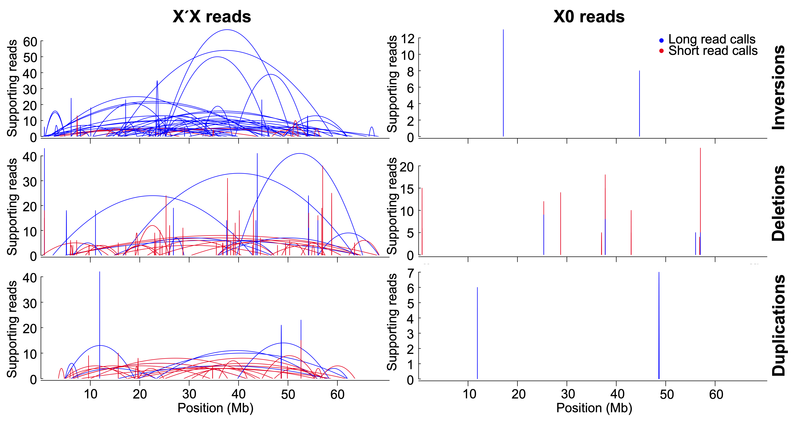
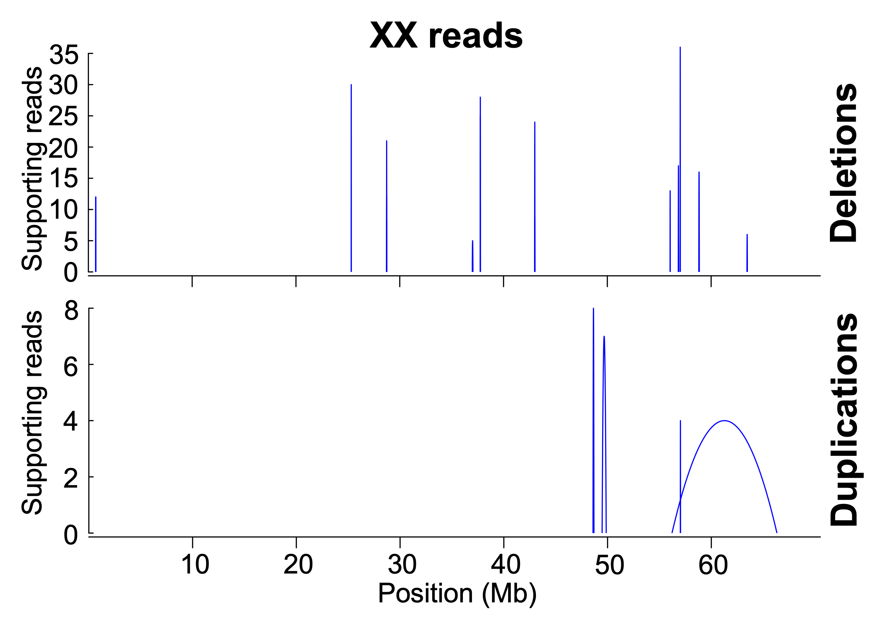
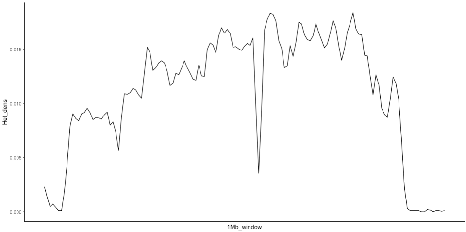
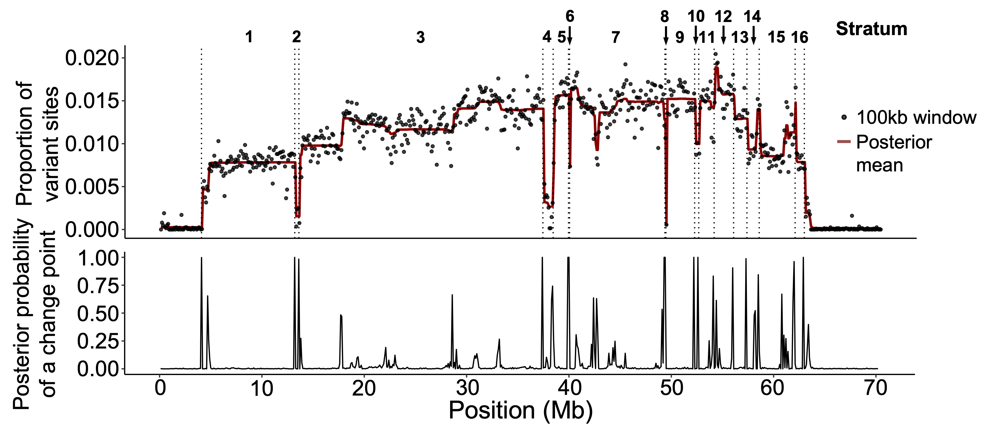

# X'X divergence and stratification of the X'

## I. STRUCTURAL VARIANT CALLING

The aim here is to see if we can identify the breakpoints of the long paracentric inversion described by Crouse (1960; 1979) by mapping short-read and long-read data from X'X individuals to Bcop_v2. Bcop_v2 is an updated version of Bcop_v1 (Urban et al. 2021) which has been scaffolded with male (X0) HiC reads, and is chromosome-level. Hopefully, reads from the X' will get force-mapped to the X and we can visualise the breakpoints.

Software used:
- BWA 0.7.17-r1198-dirty
- SAMtools Version: 1.7 (using htslib 1.7)
- smoove version: 0.2.8
- bedtools v2.26.0
- sniffles v2
- svtools
- SnpEff
- SnpSift

Analysis done by John Urban (dr.john.urban@gmail.com) and Rob Baird (robert.baird@ed.ac.uk).

**Mapping and calling variants from short reads**

```
# map paired-end reads
${BWA} mem -t ${P} ${BWAIDX} ${R1} ${R2} 2> ${ERR} | samtools sort -@ ${P} -T ${OUTBASE} 2>> ${ERR} > ${BAM}
# Merge BAMs If/Where appropriate
samtools merge ${MERGE_BAM} ${IN_BAM_1} … ${IN_BAM_N}
# Make sure reference fasta and BAM files are indexed
samtools faidx ${REF}
samtools index ${BAM} 
# Run flagstat to check mapping rates
samtools flagstat *bam >> mapping_stats.txt
# Run Smoove
smoove call -o smoove --processes 2 --fasta ${REF} --name ${BASE} ${BAM}
```

Interestingly, the mapping rates are very high for all three genotypes:
| genotype | % mapped reads |
|-|-|
| X0 | 93.58% |
| XX | 96.68% |
| X'X | 96.34% |

That the mapping rate is basically just as high for the X'X genotype indicates (i) that the X' is probably not that diverged from the X, and (ii) that we will be able to quite reliably call variants (whether structural or single-nucleotide) with X'-X alignments.

Convert VCF files to BED

```
for VCF in smoove/*.vcf.gz ; do 
## Get vars
DIR=$( dirname $VCF ) ; 
BASE=$( basename $VCF .vcf.gz ) ; 
echo $BASE ; 

## Create histogram
gunzip -c ${VCF} | awk '$1 !~ /^#/ {OFS="\t"; gsub(/;|=/,"\t"); print $9}'  | sort | uniq -c | 
awk 'OFS="\t" {print $2,$1}' | cat - <( echo -e "BND\t0\nDUP\t0\nDEL\t0\nINV\t0" ) | awk '{a[$1]+=$2}END{for (e in a) print e"\t"a[e]}' | sort -k1,1 > ${DIR}/${BASE}-SVTYPE-hist.txt ; 

## Create BND BED from VCF
gunzip -c $VCF | grep BND | grep -v "^#" | awk 'OFS="\t" {gsub(/;|=/,"\t"); print $1,$2,$2+1,1}' > ${DIR}/${BASE}-BND.bed ; 

## Create INV / DEL / DUP BEDs from VCF
for SV in INV DEL DUP ; do 
echo $SV ; 
gunzip -c $VCF | grep ${SV} | grep -v "^#" | awk 'OFS="\t" {gsub(/;|=/,"\t"); print $1,$2,$15,$13}' > ${DIR}/${BASE}-${SV}.bed ; 
done; 
done

## Get SUPPORT BED files
## (chr, start, end, name, score, strand, other)
## Ignoring “BND”
## These BED files can be further partitioned into INV / DEL / DUP

for VCF in smoove/*.vcf.gz ; do 
DIR=$( dirname $VCF ) ; 
BASE=$( basename $VCF .vcf.gz ) ; 
echo $BASE ; 

gunzip -c ${VCF} | grep -E -v '^#|SVTYPE=BND' | awk '{OFS="\t"; match($0, /PE=[0-9]*;SR=[0-9]*/) ; SU=substr($0, RSTART, RLENGTH); match($0, /SU=[0-9]*/); SCORE=substr($0, RSTART+3, RLENGTH-3); match($0, /END=[0-9]*/) ; ENDPOS=substr($0, RSTART+4, RLENGTH-4); match($0, /STRANDS=.*;SVLEN/) ; STRANDS=substr($0, RSTART, RLENGTH-6); print $1,$2,ENDPOS,$5"_SV"$3,SCORE,"+",SU";"STRANDS}' | awk '{gsub(/>|</,"");  print}' > ${DIR}/${BASE}-SUPPORT.bed ; 

done

# convert to bedpe (for plotting with Sushi):
~/software/svtools/vcfToBedpe -i ${BASE}-SUPPORT.bed -o ${BASE}-SUPPORT.bedpe
```

**Mapping and calling variants from long reads**

```
# map
for file in $(ls *.fq.gz)
do
	base=$(basename ${file} ".fq.gz")
	bwa mem -t 32 Bcop_v2-chromosomes.fasta ${base}.fq.gz \
	| samtools view -bS - > ${base}.bam \
	&& samtools sort -@8 ${base}.bam > ${base}.sorted.bam \
	&& samtools index ${base}.sorted.bam
done
# call variants
for file in $(ls *.bam)
do
	base=$(basename ${file} ".bam")
	sniffles --threads 24 --input ${base}.bam --vcf ${base}.sniffles.vcf \
	&& gzip ${base}.sniffles.vcf
done
# convert vcf to bedpe (for plotting with Sushi):
~/software/svtools/vcfToBedpe -i rob_pacb_XpX_to_Bcop_v2.sniffles.vcf -o rob_pacb_XpX_to_Bcop_v2.sniffles.bedpe
~/software/svtools/vcfToBedpe -i john_pacb_X0_to_Bcop_v2.sniffles.vcf -o john_pacb_X0_to_Bcop_v2.sniffles.bedpe
# print N supporting reads as a column so I can plot support:
wc -l rob_pacb_XpX_to_Bcop_v2.sniffles.bedpe
# 17018
cat rob_pacb_XpX_to_Bcop_v2.sniffles.bedpe | tail -n 17017 | sed 's/;/\t/g' | cut -f1,2,3,4,5,6,7,8,9,10,11,17 | sed 's/SUPPORT=//g' > rob_pacb_XpX_to_Bcop_v2.sniffles.mod.bedpe
# cols here are ('chrom1', 'start1', 'end1', 'chrom2', 'start2', 'end2', 'ID', 'qual', 'strand1', 'strand2', 'support')
wc -l john_pacb_X0_to_Bcop_v2.sniffles.bedpe
# 617
cat john_pacb_X0_to_Bcop_v2.sniffles.bedpe | tail -n 616 | sed 's/;/\t/g' | cut -f1,2,3,4,5,6,7,8,9,10,11,17 | sed 's/SUPPORT=//g' > john_pacb_X0_to_Bcop_v2.sniffles.mod.bedpe
# BND rows are wrong, but that's fine because I won't be plotting them.
```


**Plotting SVs**

For this, I'm using the R package Sushi https://github.com/PhanstielLab/Sushi.

I'll only plot SVs that have >=4 supporting reads and are over 10kb in length.

```
library(data.table)
library(Sushi)
setwd('/Users/robertbaird/Documents/analyses/variant_calling')

# Using Sushi to plot. Sushi's loop plots work with .bedpe files
# Used svtools vcfToBedpe to confert VCFs to BEDPE 
# plotting SVs > 10kb makes the plots a lot less busy...
# disclaimer: I'm not the best with R (Rob speaking), and I do a lot of copy-pasting. It gets the job done...

#### LONG READS

### XpX calls
XpX_LR_calls <- read.table("rob_pacb_XpX_to_Bcop_v2.sniffles.mod.bedpe", sep="\t", header=F, stringsAsFactors=F)
colnames(XpX_LR_calls) <- c('chrom1', 'start1', 'end1', 'chrom2', 'start2', 'end2', 'ID', 'qual', 'strand1', 'strand2', 'type', 'support')
XpX_LR_calls <- XpX_LR_calls[which(XpX_LR_calls$type == "DUP" | XpX_LR_calls$type == "DEL" | XpX_LR_calls$type == "INV"),]
XpX_LR_calls$support <- as.numeric(XpX_LR_calls$support)
XpX_LR_calls <- XpX_LR_calls[which(XpX_LR_calls$support >= 4),]
XpX_LR_calls$span <- XpX_LR_calls$start2-XpX_LR_calls$start1
nrow(XpX_LR_calls) # 7686
nrow(XpX_LR_calls[which(XpX_LR_calls$chrom1 == "X"),]) # 4361
XpX_LR_calls_10kb <- XpX_LR_calls[which(XpX_LR_calls$span >= 10000),]
### X0 calls
X0_LR_calls <- read.table("john_pacb_X0_to_Bcop_v2.sniffles.mod.bedpe", sep="\t", header=F, stringsAsFactors=F)
colnames(X0_LR_calls) <- c('chrom1', 'start1', 'end1', 'chrom2', 'start2', 'end2', 'ID', 'qual', 'strand1', 'strand2', 'type', 'support')
X0_LR_calls <- X0_LR_calls[which(X0_LR_calls$type == "DUP" | X0_LR_calls$type == "DEL" | X0_LR_calls$type == "INV"),]
X0_LR_calls$support <- as.numeric(X0_LR_calls$support)
X0_LR_calls <- X0_LR_calls[which(X0_LR_calls$support >= 4),]
X0_LR_calls$span <- X0_LR_calls$start2-X0_LR_calls$start1
nrow(X0_LR_calls) # 130
nrow(X0_LR_calls[which(X0_LR_calls$chrom1 == "X"),]) # 23
X0_LR_calls_10kb <- X0_LR_calls[which(X0_LR_calls$span >= 10000),]

# assign numeric values to SV type for plotting (seems to throw error is using strings)
XpX_LR_calls_10kb$type_num <- NA
XpX_LR_calls_10kb$type_num[XpX_LR_calls_10kb$type == "INV"] <- 1
XpX_LR_calls_10kb$type_num[XpX_LR_calls_10kb$type == "DEL"] <- 2
XpX_LR_calls_10kb$type_num[XpX_LR_calls_10kb$type == "DUP"] <- 3
X0_LR_calls_10kb$type_num <- NA
X0_LR_calls_10kb$type_num[X0_LR_calls_10kb$type == "INV"] <- 1
X0_LR_calls_10kb$type_num[X0_LR_calls_10kb$type == "DEL"] <- 2
X0_LR_calls_10kb$type_num[X0_LR_calls_10kb$type == "DUP"] <- 3

# PLOTTING SVs TOGETHER
chrom = "X"
chromstart = 0
chromend = 70507862
# XpX
pdf(file="XpX_10kb_SVs.pdf", width=10, height=4)
pbpe_XpX = plotBedpe(XpX_LR_calls_10kb,chrom,chromstart,chromend,
                         heights = XpX_LR_calls_10kb$support,plottype="loops",
                         colorby=XpX_LR_calls_10kb$type_num,
                         colorbycol=SushiColors(3))
labelgenome(chrom, chromstart,chromend,n=8,scale="Mb")
legend("topright",inset =0.01,legend=c("Inversions","Deletions","Duplications"),
       col=SushiColors(3)(3),pch=19,bty='n',text.font=2)
axis(side=2,las=2,tcl=.2)
mtext("Support",side=2,line=1.75,cex=.75,font=2)
dev.off()

# X0
pdf(file="X0_10kb_SVs.pdf", width=10, height=4)
pbpe_X0 = plotBedpe(X0_LR_calls_10kb,chrom,chromstart,chromend,
                     heights = as.numeric(X0_LR_calls_10kb$support),plottype="loops",
                     colorby=X0_LR_calls_10kb$type_num,
                     colorbycol=SushiColors(3))
labelgenome(chrom, chromstart,chromend,n=8,scale="Mb")
legend("topright",inset =0.01,legend=c("Inversions","Deletions","Duplications"),
       col=SushiColors(3)(3),pch=19,bty='n',text.font=2)
axis(side=2,las=2,tcl=.2)
mtext("Support",side=2,line=1.75,cex=.75,font=2)
dev.off()

#### SHORT READS

### XpX valls
XpX_SR_calls <- read.table("XpX_adult_female_sciara_coprophila-bwa-merged-reps-smoove-SUPPORT.bedpe",sep="\t",header=F)
colnames(XpX_SR_calls) <- c('chrom1', 'start1', 'end1', 'chrom2', 'start2', 'end2', 'ID', 'support', 'strand1', 'strand2', 'type')
XpX_SR_calls_10kb <- XpX_SR_calls[which(XpX_SR_calls$start2-XpX_SR_calls$start1 > 10000),]
XpX_SR_calls_10kb$call_type <- 2

### X0 calls
X0_SR_calls <- read.table("XO_adult_male_sciara_coprophila-bwa-merged-reps-smoove-SUPPORT.bedpe",sep="\t",header=F)
colnames(X0_SR_calls) <- c('chrom1', 'start1', 'end1', 'chrom2', 'start2', 'end2', 'ID', 'support', 'strand1', 'strand2', 'type')
X0_SR_calls_10kb <- X0_SR_calls[which(X0_SR_calls$start2-X0_SR_calls$start1 > 10000),]
X0_SR_calls_10kb$call_type <- 2

### combine SR + LR for DUP/DEL/INV, assign numeric values to call_type for plotting
XpX_LR_calls_10kb <- XpX_LR_calls_10kb[,c(1:7,9:12)]
X0_LR_calls_10kb <- X0_LR_calls_10kb[,c(1:7,9:12)]
XpX_LR_calls_10kb$call_type <- 1 # from line 37
X0_LR_calls_10kb$call_type <- 1
# INVs
XpX_SR_calls_10kb_INV <- XpX_SR_calls_10kb[which(XpX_SR_calls_10kb$type == "INV"),]
XpX_LR_calls_10kb_INV <- XpX_LR_calls_10kb[which(XpX_LR_calls_10kb$type == "INV"),]
XpX_merged_calls_10kb_INV <- merge(XpX_SR_calls_10kb_INV, XpX_LR_calls_10kb_INV, by=c('chrom1', 'start1', 'end1', 'chrom2', 'start2', 'end2', 'ID', 'support', 'strand1', 'strand2', 'type', 'call_type'), all=T)
X0_SR_calls_10kb_INV <- X0_SR_calls_10kb[which(X0_SR_calls_10kb$type == "INV"),]
X0_LR_calls_10kb_INV <- X0_LR_calls_10kb[which(X0_LR_calls_10kb$type == "INV"),]
X0_merged_calls_10kb_INV <- merge(X0_SR_calls_10kb_INV, X0_LR_calls_10kb_INV, by=c('chrom1', 'start1', 'end1', 'chrom2', 'start2', 'end2', 'ID', 'support', 'strand1', 'strand2', 'type', 'call_type'), all=T)
# DELs
XpX_SR_calls_10kb_DEL <- XpX_SR_calls_10kb[which(XpX_SR_calls_10kb$type == "DEL"),]
XpX_LR_calls_10kb_DEL <- XpX_LR_calls_10kb[which(XpX_LR_calls_10kb$type == "DEL"),]
XpX_merged_calls_10kb_DEL <- merge(XpX_SR_calls_10kb_DEL, XpX_LR_calls_10kb_DEL, by=c('chrom1', 'start1', 'end1', 'chrom2', 'start2', 'end2', 'ID', 'support', 'strand1', 'strand2', 'type', 'call_type'), all=T)
X0_SR_calls_10kb_DEL <- X0_SR_calls_10kb[which(X0_SR_calls_10kb$type == "DEL"),]
X0_LR_calls_10kb_DEL <- X0_LR_calls_10kb[which(X0_LR_calls_10kb$type == "DEL"),]
X0_merged_calls_10kb_DEL <- merge(X0_SR_calls_10kb_DEL, X0_LR_calls_10kb_DEL, by=c('chrom1', 'start1', 'end1', 'chrom2', 'start2', 'end2', 'ID', 'support', 'strand1', 'strand2', 'type', 'call_type'), all=T)
# DUPs
XpX_SR_calls_10kb_DUP <- XpX_SR_calls_10kb[which(XpX_SR_calls_10kb$type == "DUP"),]
XpX_LR_calls_10kb_DUP <- XpX_LR_calls_10kb[which(XpX_LR_calls_10kb$type == "DUP"),]
XpX_merged_calls_10kb_DUP <- merge(XpX_SR_calls_10kb_DUP, XpX_LR_calls_10kb_DUP, by=c('chrom1', 'start1', 'end1', 'chrom2', 'start2', 'end2', 'ID', 'support', 'strand1', 'strand2', 'type', 'call_type'), all=T)
X0_SR_calls_10kb_DUP <- X0_SR_calls_10kb[which(X0_SR_calls_10kb$type == "DUP"),]
X0_LR_calls_10kb_DUP <- X0_LR_calls_10kb[which(X0_LR_calls_10kb$type == "DUP"),]
X0_merged_calls_10kb_DUP <- merge(X0_SR_calls_10kb_DUP, X0_LR_calls_10kb_DUP, by=c('chrom1', 'start1', 'end1', 'chrom2', 'start2', 'end2', 'ID', 'support', 'strand1', 'strand2', 'type', 'call_type'), all=T)
### PLOT
chrom = "X"
chromstart = 0
chromend = 70507862
## INVs
# XpX
pdf(file="XpX_10kb_INVs.pdf", width=8, height=4)
pbpe_XpX_inv = plotBedpe(XpX_merged_calls_10kb_INV,chrom,chromstart,chromend,
                     heights = XpX_merged_calls_10kb_INV$support,plottype="loops",
                     colorby=XpX_merged_calls_10kb_INV$call_type,
                     colorbycol=SushiColors(2))
labelgenome(chrom, chromstart,chromend,n=8,scale="Mb")
axis(side=2,las=2,tcl=.2)
mtext("Support",side=2,line=1.75,cex=.75,font=2)
dev.off()
# X0
pdf(file="X0_10kb_INVs.pdf", width=8, height=4)
pbpe_XpX_inv = plotBedpe(X0_merged_calls_10kb_INV,chrom,chromstart,chromend,
                         heights = X0_merged_calls_10kb_INV$support,plottype="loops",color="blue")
labelgenome(chrom, chromstart,chromend,n=8,scale="Mb")
axis(side=2,las=2,tcl=.2)
mtext("Support",side=2,line=1.75,cex=.75,font=2)
dev.off()
## DELs
# XpX
pdf(file="XpX_10kb_DELs.pdf", width=8, height=4)
pbpe_XpX_del = plotBedpe(XpX_merged_calls_10kb_DEL,chrom,chromstart,chromend,
                         heights = XpX_merged_calls_10kb_DEL$support,plottype="loops",
                         colorby=XpX_merged_calls_10kb_DEL$call_type,
                         colorbycol=SushiColors(2))
labelgenome(chrom, chromstart,chromend,n=8,scale="Mb")
axis(side=2,las=2,tcl=.2)
mtext("Support",side=2,line=1.75,cex=.75,font=2)
dev.off()
# X0
pdf(file="X0_10kb_DELs.pdf", width=8, height=4)
pbpe_XpX_del = plotBedpe(X0_merged_calls_10kb_DEL,chrom,chromstart,chromend,
                         heights = X0_merged_calls_10kb_DEL$support,plottype="loops",
                         colorby=X0_merged_calls_10kb_DEL$call_type,
                         colorbycol=SushiColors(2))
labelgenome(chrom, chromstart,chromend,n=8,scale="Mb")
axis(side=2,las=2,tcl=.2)
mtext("Support",side=2,line=1.75,cex=.75,font=2)
dev.off()
## DUPs
# XpX
pdf(file="XpX_10kb_DUPs.pdf", width=8, height=4)
pbpe_XpX_del = plotBedpe(XpX_merged_calls_10kb_DUP,chrom,chromstart,chromend,
                         heights = XpX_merged_calls_10kb_DUP$support,plottype="loops",
                         colorby=XpX_merged_calls_10kb_DUP$call_type,
                         colorbycol=SushiColors(2))
labelgenome(chrom, chromstart,chromend,n=8,scale="Mb")
axis(side=2,las=2,tcl=.2)
mtext("Support",side=2,line=1.75,cex=.75,font=2)
dev.off()
# X0
pdf(file="X0_10kb_DUPs.pdf", width=8, height=4)
pbpe_XpX_del = plotBedpe(X0_merged_calls_10kb_DUP,chrom,chromstart,chromend,
                         heights = X0_merged_calls_10kb_DUP$support,plottype="loops",color="blue")
labelgenome(chrom, chromstart,chromend,n=8,scale="Mb")
axis(side=2,las=2,tcl=.2)
mtext("Support",side=2,line=1.75,cex=.75,font=2)
dev.off()

# count each type...
nrow(XpX_LR_calls[which(XpX_LR_calls$chrom1 == "X" & XpX_LR_calls$type == "INV"),]) # 267
nrow(XpX_LR_calls[which(XpX_SR_calls$chrom1 == "X" & XpX_SR_calls$type == "INV"),]) # 29
nrow(XpX_LR_calls[which(XpX_LR_calls$chrom1 == "X" & XpX_LR_calls$type == "DEL"),]) # 4037
nrow(XpX_LR_calls[which(XpX_SR_calls$chrom1 == "X" & XpX_SR_calls$type == "DEL"),]) # 2697
nrow(XpX_LR_calls[which(XpX_LR_calls$chrom1 == "X" & XpX_LR_calls$type == "DUP"),]) # 57
nrow(XpX_LR_calls[which(XpX_SR_calls$chrom1 == "X" & XpX_SR_calls$type == "DUP"),]) # 56
nrow(X0_LR_calls[which(X0_LR_calls$chrom1 == "X" & X0_LR_calls$type == "INV"),]) # 11
nrow(X0_SR_calls[which(X0_SR_calls$chrom1 == "X" & X0_SR_calls$type == "INV"),]) # 0
nrow(X0_LR_calls[which(X0_LR_calls$chrom1 == "X" & X0_LR_calls$type == "DEL"),]) # 9
nrow(X0_SR_calls[which(X0_SR_calls$chrom1 == "X" & X0_SR_calls$type == "DEL"),]) # 20
nrow(X0_LR_calls[which(X0_LR_calls$chrom1 == "X" & X0_LR_calls$type == "DUP"),]) # 3
nrow(X0_SR_calls[which(X0_SR_calls$chrom1 == "X" & X0_SR_calls$type == "DUP"),]) # 1

### PLOTTING XX SR CALLS FOR SUPPLEMENTARY

XX_SR_calls <- read.table("XX_adult_female_sciara_coprophila-bwa-merged-reps-smoove-SUPPORT.bedpe",sep="\t",header=F)
colnames(XX_SR_calls) <- c('chrom1', 'start1', 'end1', 'chrom2', 'start2', 'end2', 'ID', 'support', 'strand1', 'strand2', 'type')
XX_SR_calls_10kb <- XX_SR_calls[which(XX_SR_calls$start2-XX_SR_calls$start1 > 10000),]
XX_SR_calls_10kb$call_type <- 2

chrom = "X"
chromstart = 0
chromend = 70507862

## INVs
XX_SR_calls_10kb_INV <- XX_SR_calls_10kb[which(XX_SR_calls_10kb$type == "INV"),]
pdf(file="XX_10kb_INVs.pdf", width=8, height=4)
pbpe_XpX_inv = plotBedpe(XX_SR_calls_10kb_INV,chrom,chromstart,chromend,
                         heights = XX_SR_calls_10kb_INV$support,plottype="loops",color="blue")
labelgenome(chrom, chromstart,chromend,n=8,scale="Mb")
axis(side=2,las=2,tcl=.2)
mtext("Support",side=2,line=1.75,cex=.75,font=2)
dev.off()
## DELs
XX_SR_calls_10kb_DEL <- XX_SR_calls_10kb[which(XX_SR_calls_10kb$type == "DEL"),]
pdf(file="XX_10kb_DELs.pdf", width=8, height=4)
pbpe_XpX_del = plotBedpe(XX_SR_calls_10kb_DEL,chrom,chromstart,chromend,
                         heights = XX_SR_calls_10kb_DEL$support,plottype="loops",color="blue")
labelgenome(chrom, chromstart,chromend,n=8,scale="Mb")
axis(side=2,las=2,tcl=.2)
mtext("Support",side=2,line=1.75,cex=.75,font=2)
dev.off()
## DUPs
XX_SR_calls_10kb_DUP <- XX_SR_calls_10kb[which(XX_SR_calls_10kb$type == "DUP"),]
pdf(file="XX_10kb_DUPs.pdf", width=8, height=4)
pbpe_XpX_del = plotBedpe(XX_SR_calls_10kb_DUP,chrom,chromstart,chromend,
                         heights = XX_SR_calls_10kb_DUP$support,plottype="loops",color="blue")
labelgenome(chrom, chromstart,chromend,n=8,scale="Mb")
axis(side=2,las=2,tcl=.2)
mtext("Support",side=2,line=1.75,cex=.75,font=2)
dev.off()
```

Here's what the figures look like:




Well, it looks like those SV calls for the X'X genotype are biological artefacts since the X0/XX calls suggest that they're not just due to misassemblies on the X. Rather than one long, clean inversion witht wo breakpoints, we see a load of entangled and contradictory SV signals.

This seems highly suggestive of more than one rearrangement. In fact, I showed Brian (Charlesworth) some polytene chromosome squashes of X'X females and he reckons it looks like there are at least three inversions present, but it's hard to tell whether they are overlapping, adjacent, nested etc.

It might be that we can get a better picture of what's going using HiC reads.

## II. MAPPING AND VISUALISING HIC READS

We have HiC reads for both males (X0) courtesy of John (Spradling lab) and for female-producers (X'X) courtesy of Ross lab. 

**Map HiC reads to Bcop_v2 with Juicer**
```
/scratch/$USER/$JOB_ID/Juicer/scripts/juicer.sh -z /scratch/$USER/$JOB_ID/Juicer/references/Bcop_v2-chromosomes.fasta -t 40 -p assembly
```

**Plotting HiC contact heatmap**
Using the script HiC_view.py (https://github.com/A-J-FMackintosh/Mackintosh_et_al_2022_Ipod). Coverage for the X'X data is a lot higher, so I'm increasing the saturation for the X0 file so they look comparable. The -s flag represents the number of reads required to reach saturation (default=50)
```
/data/ross/flies/analyses/Bcoprophila_Xprime/scripts/HiC_view.py -g genomefile_X.txt -b 1000 -m X0_merged_nodups.txt -s 20 -f 10  -t 5
/data/ross/flies/analyses/Bcoprophila_Xprime/scripts/HiC_view.py -g genomefile_X.txt -b 1000 -m XpX_merged_nodups.txt -s 50 -f 10  -t 5
```


The two 'main' breakpoints are clearly visible, as are the fold-back repeats (FBRs) described by Crouse (1979). The repeats are presumably where the X chromosome folds back on itself to pair with - the polytene X forms a ring-like structure. However, while there are clearly some smaller-scale differences along the chromosome, it's difficult to spot any larger rearrangements between those two main breakpoints.

## III. SNV plotting

We can look at single-nucleotide variants (SNVs, i.e. heterozygous sites) along the chromosome to analyse divergence. I'll call variants with GATK-4 (best practices pipeline, https://gatk.broadinstitute.org/hc/en-us/sections/360007226651-Best-Practices-Workflows), but before doing so it is necessary to process the bam files.

```
# sort sort with picard, mark and remove duplicates, assign unique readgroups to each sample
for file in $(ls *.bam)
do
	base=$(basename $file ".bam")
	picard SortSam I=${base}.bam SORT_ORDER=coordinate O=${base}.sorted.bam
	samtools index ${base}.sorted.bam
	picard MarkDuplicates MAX_RECORDS_IN_RAM=400000 INPUT=${base}.sorted.bam OUTPUT=${base}.sorted.rmdup.bam M=${base}.met.txt REMOVE_DUPLICATES=true
	picard AddOrReplaceReadGroups INPUT=${base}.sorted.rmdup.bam OUTPUT=${base}.sorted.rmdup.rg.bam RGID=${base} RGLB=${base} RGPL=illumina RGPU=unit1 RGSM=${base}
done

# call & filter variants
cat Bcop_v2-chromosomes.fasta Bcop_v2-associated_contigs-semifinal.fasta >> Bcop_v2-chromosomes_all.fasta
samtools faidx Bcop_v2-chromosomes_all.fasta
/ceph/users/rbaird/software/gatk/gatk CreateSequenceDictionary -R Bcop_v2-chromosomes_all.fasta

for file in $(ls *.sorted.rmdup.rg.bam)
do
	base=$(basename $file ".sorted.rmdup.rg.bam")
	samtools index ${base}.sorted.rmdup.rg.bam
	# call variants
	/ceph/users/rbaird/software/gatk/gatk --java-options "-Xmx4g" HaplotypeCaller \
   -R Bcop_v2-chromosomes_all.fasta \
   -I ${base}.sorted.rmdup.rg.bam \
   -O ${base}.hom.vcf.gz \
   --output-mode EMIT_ALL_CONFIDENT_SITES \
   -ERC GVCF
   # genotype VCF:
   /ceph/users/rbaird/software/gatk/gatk --java-options "-Xmx4g" GenotypeGVCFs \
   -R Bcop_v2-chromosomes_all.fasta \
   -V ${base}.hom.vcf.gz \
   -O ${base}.hom.g.vcf.gz \
   --include-non-variant-sites
   # filter for SNPs
	/ceph/users/rbaird/software/gatk/gatk SelectVariants -R Bcop_v2-chromosomes_all.fasta -V ${base}.hom.g.vcf.gz -O ${base}.g.SNPs.vcf.gz --select-type-to-include SNP -select "QD > 2.0" -select "FS < 60.0" -select "MQ > 40.0"
	# filter for indels
	/ceph/users/rbaird/software/gatk/gatk SelectVariants -R Bcop_v2-chromosomes_all.fasta -V ${base}.hom.g.vcf.gz -O ${base}.g.indels.vcf.gz --select-type-to-include INDEL -select "QD > 2.0" -select "FS < 60.0" -select "MQ > 40.0"
done
```

**Density of SNVs**

Using popgenWindows.py from the genomics_general toolkit (https://github.com/simonhmartin/genomics_general) to calculate the density of SNVs across 100kb windows (need to parse the vcf files first). I am requiring an SNV to have 4 supporting reads:
```
for file in $(ls *.vcf.gz)
do
	base=$(basename $file ".hom.g.vcf.gz")
	python ~/software/genomics_general/VCF_processing/parseVCF.py -i ${base}.hom.g.vcf.gz --minQual 30 --gtf flag=DP min=4 max=50 -o ${base}.geno.gz
	python ~/software/genomics_general/popgenWindows.py -w 100000 --analysis indHet -g ${base}.geno.gz -o ${base}.indHet_dens.csv.gz -f phased -T 8
done
```

In order to subtract background heterozygosity, I'll remove any heterozygous SNVs in the X'X sample that are also present in the X0 sample:
```
# XpX - read in, get means
XpX_r1_SNVs <- read.csv('XpX_adult_female_sciara_coprophila_rep1-bwa.indHet_dens.csv.gz',header=T, stringsAsFactors=FALSE)
XpX_r2_SNVs <- read.csv('XpX_adult_female_sciara_coprophila_rep2-bwa.indHet_dens.csv.gz',header=T, stringsAsFactors=FALSE)
XpX_merged_SNVs <- merge(XpX_r1_SNVs, XpX_r2_SNVs, by=c('scaffold','start','end'))
XpX_merged_SNVs_X <- XpX_merged_SNVs[which(XpX_merged_SNVs$scaffold == "X"),]
XpX_merged_SNVs_X <- na.omit(XpX_merged_SNVs_X)
XpX_merged_SNVs_X$mean_het <- rowMeans(XpX_merged_SNVs_X[,c(6,9)])
XpX_merged_SNVs_X <- XpX_merged_SNVs_X[,c(2,3,4,10)]
colnames(XpX_merged_SNVs_X) <- c('start', 'end', 'mid', 'het_mean_XpX')
XpX_merged_SNVs_X <- XpX_merged_SNVs_X[order(XpX_merged_SNVs_X$start),]

# X0 - read in, get means
X0_r1_SNVs <- read.csv('XO_adult_male_sciara_coprophila_rep1-bwa.indHet_dens.csv.gz',header=T, stringsAsFactors=FALSE)
X0_r2_SNVs <- read.csv('XO_adult_male_sciara_coprophila_rep2-bwa.indHet_dens.csv.gz',header=T, stringsAsFactors=FALSE)
X0_merged_SNVs <- merge(X0_r1_SNVs, X0_r2_SNVs, by=c('scaffold', 'start', 'end'))
X0_merged_SNVs_X <- X0_merged_SNVs[which(X0_merged_SNVs$scaffold == "X"),]
X0_merged_SNVs_X <- na.omit(X0_merged_SNVs_X)
X0_merged_SNVs_X$het_mean <- rowMeans(X0_merged_SNVs_X[,c(6,9)])
X0_merged_SNVs_X <- X0_merged_SNVs_X[,c(2,3,10)]
colnames(X0_merged_SNVs_X) <- c('start', 'end', 'het_mean_X0')
X0_merged_SNVs_X <- X0_merged_SNVs_X[order(X0_merged_SNVs_X$start),]

# merge and subtract background heterozygosity
merged_SNVs <- merge(XpX_merged_SNVs_X, X0_merged_SNVs_X, by=c('start', 'end'))
merged_SNVs$true_het <- merged_SNVs$het_mean_XpX-merged_SNVs$het_mean_X0
# few rows have negative het (but v small values) - this is impossible, so replace values with 0
merged_SNVs[merged_SNVs<0] <- 0
merged_SNVs <- merged_SNVs[with(merged_SNVs, order(+mid)),]
rownames(merged_SNVs) <- NULL
```

This is what the density of SNVs looks like across the X:



There are clearly distinct regions with different levels of divergence - they look a lot like strata. There are even dips of heterozygosity - maybe these are gaps between adjacent inversions that still pair and recombine with the X?

Assuming these are evolutionary strata, I'll use a statistical method for delineating the breakpoints between the strata. I'll use the R package bcp to run a change-point analysis (https://cran.r-project.org/web/packages/bcp/bcp.pdf).

Bcp employs a bayesian approach, so it's necessary to provide a prior probability estimate for change-points. The unit size is 100kb. in the SV density plots, we see something like 10ish changes in SV density along the X. This means on average, if we assume the X is about 50Mb, we expect a change every 5Mb or so. This translates to expecting a change every 50 bins or so, i.e. a prior of 0.02.

```
bcp_het <- bcp(merged_SNVs$true_het, p0 = 0.02, return.mcmc = TRUE)

# test plot
pdf(file="bcp_plot_p0.02.pdf", width=10, height=4)
plot(bcp_het)
dev.off()

# identify the windows where probability of change is high (e.g. >70%):
bcp_sum <- as.data.frame(summary(bcp_het))
high_prob_change <- bcp_sum[which(bcp_sum$Probability > 0.7), ]
head(high_prob_change)
nrow(high_prob_change) # 17

# write out posterior means + posterior probabiltiies as dfs
posterior_means <- as.data.frame(bcp_het$posterior.mean)
write.table(posterior_means, file='posterior_means_bcp_17.txt', quote=F, sep="\t", row.names=F, col.names=F)
posterior_prob <- as.data.frame(bcp_het$posterior.prob)
write.table(posterior_prob, file='posterior_prob_bcp_17.txt', quote=F, sep="\t", row.names=F, col.names=F)

# delineating strata (geting the breakpoint positions)
high_prob_changes <- bcp_sum[which(bcp_sum$Probability > 0.7), ]
# row name = window end position (i.e. 41 = 4100000)
high_prob_changes$idx <- as.numeric(row.names(high_prob_changes))
# assign the mid point of the window as the breakpoint start position (i.e. 40.5 = 4050000)
high_prob_changes$start <- high_prob_changes$idx-0.5
breakpoints <- high_prob_changes$start

### PLOTTING
# Using ggplot2 to plot posterior means over SNV density + posterior probabilities

# generate df from posterior means
posterior_means <- as.data.frame(bcp_het$posterior.mean)
# create row idx
posterior_means$idx <- as.numeric(row.names(posterior_means))
# create row idx for SNVs
rownames(merged_SNVs) <- NULL
merged_SNVs$idx <- as.numeric(row.names(merged_SNVs))
# merge posterior means + SNV dfs
merged_data <- merge(posterior_means, merged_SNVs, by=c('idx'))

# plot - with blank x axis + breakpoints as dotted lines
pdf(file="posterior_means_17pcs.pdf", width=10, height=2.5)
ggplot(merged_data, aes(idx))+ 
  geom_line(aes(y = X1), color = "red4", size=1)+ 
  geom_point(aes(y = true_het), colour="black", size=1, alpha=0.75)+
  geom_vline(xintercept=breakpoints, linetype="dotted")+
  theme_classic()+
  theme(axis.title.x=element_blank(),axis.text.x=element_blank(),axis.ticks.x=element_blank())+
  theme(axis.title.y=element_blank())
dev.off()

# generate df from posterior probabilities
posterior_prob <- as.data.frame(bcp_het$posterior.prob)
# create row idx
posterior_prob$idx <- as.numeric(row.names(posterior_prob))

# plot
pdf(file="posterior_prob_17pcs.pdf", width=10, height=2)
ggplot(posterior_prob, aes(idx))+ 
  geom_line(aes(y = bcp_het$posterior.prob), color = "black", size=0.5)+ 
  theme_classic()+
  scale_x_continuous(breaks = scales::pretty_breaks(n = 8))+
  theme(axis.title.y=element_blank())
dev.off()
```



## IV. DIVERGENCE ACROSS X'-X

I'll use two methods of calculating divergence across the X'/X. The first works by calcualting absolute divergence between haplotypes, i.e. Dxy. The second works by estimating the number of synonymous (neutral) mutations since divergence.

**Method 1 - Dxy**

Use the parsed .vcf files XpX SNV analysis above (XpX_adult_female_sciara_coprophila_rep[12].hom.g.vcf.gz) to pull variant (i.e. heterozygous) and invariant (i.e. homozygous) sites supported by >4 reads. Do this for each replicate:

```
zcat XpX_adult_female_sciara_coprophila_rep1.hom.g.vcf.gz | grep "X" | grep "0/1" | cut -f2,8 | cut -d ";" -f1,5 |  awk '{sub(/.*DP=/,"",$2); print}' | column -t | awk '$2 > 4' > variant_sites_DP5.r1.tsv
zcat XpX_adult_female_sciara_coprophila_rep1.hom.g.vcf.gz | grep "X" | grep "0/0" | cut -f2,8 | sed 's/DP=//g' | awk '$2 > 4' > invariant_sites_DP5.r1.tsv
zcat XpX_adult_female_sciara_coprophila_rep2.hom.g.vcf.gz | grep "X" | grep "0/1" | cut -f2,8 | cut -d ";" -f1,5 |  awk '{sub(/.*DP=/,"",$2); print}' | column -t | awk '$2 > 4' > variant_sites_DP5.r2.tsv
zcat XpX_adult_female_sciara_coprophila_rep2.hom.g.vcf.gz | grep "X" | grep "0/0" | cut -f2,8 | sed 's/DP=//g' | awk '$2 > 4' > invariant_sites_DP5.r2.tsv
```

Now I want to only include sites supported by both replicates:

```
# read in + merge calls
invariant_sites_DP4_r1 <- read.table('invariant_sites_DP4.r1.tsv', header=F, stringsAsFactors=F)
invariant_sites_DP4_r2 <- read.table('invariant_sites_DP4.r2.tsv', header=F, stringsAsFactors=F)
variant_sites_DP4_r1 <- read.table('variant_sites_DP4.r1.tsv', header=F, stringsAsFactors=F)
variant_sites_DP4_r2 <- read.table('variant_sites_DP4.r2.tsv', header=F, stringsAsFactors=F)

nrow(invariant_sites_DP4_r1) # 44802352
nrow(invariant_sites_DP4_r2) # 35585682
invariant_sites_DP4_consensus <- merge(invariant_sites_DP4_r1, invariant_sites_DP4_r2, by=c(1))
nrow(invariant_sites_DP4_consensus) # 29166915

nrow(variant_sites_DP4_r1) # 273371
nrow(variant_sites_DP4_r2) # 222293
variant_sites_DP4_consensus <- merge(variant_sites_DP4_r1, variant_sites_DP4_r2, by=c(1))
nrow(variant_sites_DP4_consensus) # 158951
```

Now calculate Dxy values as N het sites / N het sites + N hom sites. Then, assuming a neutral
mutation rate and a similar mutation rate to Drosophila melanogaster, i.e. between 2.8 x 10-9 (Keightley et al. 2014) and 4.9 x 10-9 (Assad et al. 2017), and a 24-40 day generation time for B. coprophila (see supplementary info), calcualte ages like so:

```
S1_var <- variant_sites_DP4_consensus[which(variant_sites_DP4_consensus$V1 >= 4050001 & variant_sites_DP4_consensus$V1 <= 13050000),]
nrow(S1_var) # 18164
S1_invar <- invariant_sites_DP4_consensus[which(invariant_sites_DP4_consensus$V1 >= 4050001 & invariant_sites_DP4_consensus$V1 <= 13050000),]
nrow(S1_invar) # 3634300
18164/(18164+3634300) # dxy = 0.004973081
0.004973081/(2*(4.9*10^-9)) # lower (gens) = 507457.2
0.004973081/(2*(2.8*10^-9)) # lower (gens) = 888050.2
507457.2/15.20833 # lower (yrs) = 33367.06
888050.2/9.125 # upper (yrs) = 97320.57
```

**Method 2 - neutral sites**

I need to calculate first the number of synonymous sites per gene. Using my annotation files (see genome assembly & annotation), I used the script partitionCDS.py (https://github.com/A-J-F-Mackintosh/Mackintosh_et_al_2022_Ipod) to annotate degeneracy for all genic sites:

```
# file prep
cat augustus.hints.gff3 | grep "jg" | gt gff3 -sort -tidy -retainids -fixregionboundaries > augustus.hints.tidy.gff3 
gff2bed < augustus.hints.tidy.gff3 > augustus.hints.tidy.gt.bed
cat augustus.hints.tidy.gt.bed | awk '$8=="CDS"' OFS="\t" | cut -f 1,2,3,4,5,6 | sort -k1,1V -k2,2n > Bcop_v2.tidy.gt.CDS.bed
cat Bcop_v2.tidy.gt.CDS.bed | awk 'BEGIN{FS=OFS="\t"} {sub(/.CDS.*/,"",$4)} 1' > Bcop_v2.tidy.gt.CDS.fixed.bed

# run parser
~/software/Mackintosh_et_al_2022_Ipod/partitioncds.py -f Bcop_v2-chromosomes.fasta -v XpX_allsamples_v_Bcop_v2.gatk.hom.g.vcf.gz -b Bcop_v2.tidy.gt.CDS.fixed.bed

# subset 0x, 2x, 3x and 4x degenerate sites:
grep "_0" gimble.cds.bed > gimble.cds.0xsites.bed 
grep "_2" gimble.cds.bed > gimble.cds.2xsites.bed 
grep "_3" gimble.cds.bed > gimble.cds.3xsites.bed 
grep "_4" gimble.cds.bed > gimble.cds.4xsites.bed 

# convert gff3 annotation to bed
gff2bed < Bcop_v2.augustus.gff3 > Bcop_v2.augustus.bed
# intersect with degeneracy annotation to get annotations for each gene
bedtools intersect -a Bcop_v2.augustus.bed -b gimble.cds.0xsites.bed > Bcop_v2.augustus.genes.0x.sites.bed
grep "mRNA" Bcop_v2.augustus.genes.0x.sites.bed | sed 's/ID=//g' | sed 's/;.*//g' > Bcop_v2.augustus.genes.0x.sites.fixed.bed
bedtools intersect -a Bcop_v2.augustus.bed -b gimble.cds.2xsites.bed > Bcop_v2.augustus.genes.2x.sites.bed
grep "mRNA" Bcop_v2.augustus.genes.2x.sites.bed | sed 's/ID=//g' | sed 's/;.*//g' > Bcop_v2.augustus.genes.2x.sites.fixed.bed
bedtools intersect -a Bcop_v2.augustus.bed -b gimble.cds.3xsites.bed > Bcop_v2.augustus.genes.3x.sites.bed
grep "mRNA" Bcop_v2.augustus.genes.3x.sites.bed | sed 's/ID=//g' | sed 's/;.*//g' > Bcop_v2.augustus.genes.3x.sites.fixed.bed
bedtools intersect -a Bcop_v2.augustus.bed -b gimble.cds.4xsites.bed > Bcop_v2.augustus.genes.4x.sites.bed
grep "mRNA" Bcop_v2.augustus.genes.4x.sites.bed | sed 's/ID=//g' | sed 's/;.*//g' > Bcop_v2.augustus.genes.4x.sites.fixed.bed
```

The above gives me synonymous and nonsynonymous sites per gene, but now I need the actual variant info. I can use the annotatation files generated above to get this, using SnpEff/SnpSift:

```
java -Xmx4g -jar ~/.conda/envs/SnpEff/SnpEff/snpEff.jar -c ~/.conda/envs/SnpEff/SnpEff/snpEff.config -v -no-downstream -no-intron -no-upstream -no-utr -no-intergenic -stats filterstats.html -canon Bradysia_coprophila XpX_v_Bcop_v2.gatk.hom.g._SNPs_only.recode.vcf > XpX_v_Bcop_v2.gatk.hom.g._SNPs_only.recode.canon.ann.vcf
java -Xmx4g -jar ~/.conda/envs/SnpEff/SnpEff/SnpSift.jar extractFields XpX_v_Bcop_v2.gatk.hom.g._SNPs_only.recode.canon.ann.vcf CHROM ANN[0].GENEID POS REF ALT isHom"(GEN[0])" ANN[*].EFFECT > XpX_v_Bcop_v2.gatk.hom.g._SNPs_only.recode_justgenessnps.txt

# Get N syn variants (variants_effect_stop_retained_variant, variants_effect_synonymous_variant):
tail -n +2 filterstats.genes.txt | cut -f3,20,21 > filterstats_syn.txt
```

Then calculate the number of synonymous variants per synonymous site per gene. Obvious the 0x degenerate sites are all nonsynoynmous and the 4x degenerate sites are all synonymous. A 2x degenerate site is 1/2 syn and 1/2 nonsyn, and a 3x site is 2/3rd syn and 1/3rd nonsynon. Therefore non <- 0x + 0.5*2x + 0.33*3x and syn <- 4x + 0.5*2x + 0.66*3x. As a sanity check, N_non + N_syn should = a whole number (just is the number of sites in the coding sequence).

Then use this to calculate divergence over all 2330 single-copy X'-X homologs (see annotation section)

```
degen_0_sites <- read.table('Bcop_v2.augustus.genes.0x.sites.fixed.bed.gz', header=F, stringsAsFactors=F)
degen_0_sites <- degen_0_sites[,c(1,2,3,10)]
colnames(degen_0_sites) <- c('chr', 'bed_start', 'bed_end', 'transcript')
degen_2_sites <- read.table('Bcop_v2.augustus.genes.2x.sites.fixed.bed.gz', header=F, stringsAsFactors=F)
degen_2_sites <- degen_2_sites[,c(1,2,3,10)]
colnames(degen_2_sites) <- c('chr', 'bed_start', 'bed_end', 'transcript')
degen_3_sites <- read.table('Bcop_v2.augustus.genes.3x.sites.fixed.bed.gz', header=F, stringsAsFactors=F)
degen_3_sites <- degen_3_sites[,c(1,2,3,10)]
colnames(degen_3_sites) <- c('chr', 'bed_start', 'bed_end', 'transcript')
degen_4_sites <- read.table('Bcop_v2.augustus.genes.4x.sites.fixed.bed.gz', header=F, stringsAsFactors=F)
degen_4_sites <- degen_4_sites[,c(1,2,3,10)]
colnames(degen_4_sites) <- c('chr', 'bed_start', 'bed_end', 'transcript')

degen_0_counts <- degen_0_sites %>% count(transcript)
colnames(degen_0_counts) <- c('transcript', '0x_sites')
degen_2_counts <- degen_2_sites %>% count(transcript)
colnames(degen_2_counts) <- c('transcript', '2x_sites')
degen_3_counts <- degen_3_sites %>% count(transcript)
colnames(degen_3_counts) <- c('transcript', '3x_sites')
degen_4_counts <- degen_4_sites %>% count(transcript)
colnames(degen_4_counts) <- c('transcript', '4x_sites')

degen_counts_02 <- merge(degen_0_counts, degen_2_counts, by=c('transcript'), all=T)
degen_counts_023 <- merge(degen_counts_02, degen_3_counts, by=c('transcript'), all=T)
all_degen_counts <- merge(degen_counts_023, degen_4_counts, by=c('transcript'), all=T)

# get N syn vs nonsyn sites
all_degen_counts$N_non <- (all_degen_counts$`0x_sites`)+(all_degen_counts$`2x_sites`*0.5)+(all_degen_counts$`3x_sites`*0.33)
all_degen_counts$N_syn <- (all_degen_counts$`4x_sites`)+(all_degen_counts$`2x_sites`*0.5)+(all_degen_counts$`3x_sites`*0.66)
nrow(all_degen_counts) # 21049
# write table for easier read-in next time:
write.table(all_degen_counts, file='all_degen_counts.tsv', row.names=F, col.names=T, quote=F, sep='\t')
all_degen_counts <- read.table('all_degen_counts.tsv', header=T, stringsAsFactors=F)

# read in counts of syn variants per gene
syn_var <- read.table('filterstats_syn.txt', header=T, stringsAsFactors=F)
syn_var$N_syn_var <- syn_var$variants_effect_stop_retained_variant+syn_var$variants_effect_synonymous_variant
syn_var <- syn_var[,c(1,4)]
colnames(syn_var) <- c('transcript', 'N_syn_vars')
all_degen_counts <- all_degen_counts[,c(1,7)]
colnames(all_degen_counts) <- c('transcript', 'N_syn_sites')
syn_sites_and_var <- merge(syn_var, all_degen_counts, by=c('transcript'))

### now get divergence
syn_sites_and_var$prop_syn_variants <- syn_sites_and_var$N_syn_vars/syn_sites_and_var$N_syn_sites
# pull single-copy homologs
sc_homologs <- read.table('orthofinder_single_copy_assignments.tsv', header=T)
sc_homologs <- sc_homologs[,c(1,3)]
colnames(sc_homologs) <- c('OG', 'transcript')
syn_sites_and_var_homs <- merge(syn_sites_and_var, sc_homologs, by=c('transcript'))
nrow(syn_sites_and_var_homs) # 2204 genes
# assuming mutation rate 2.8*10^-9 - 4.9*10^-9, generation time 24-40 days
# mutations_per_generation = (2*mutation_rate)*total_sites
# divergence_in_generations = variant_sites/mutations_per_generation
# divergence_in_years = divergence_in_generations/15.20833 to divergence_in_generations/9.125
# for lower estimate use faster mutation rate + shorter generation time
syn_sites_and_var_homs$div_generations_lower <- (syn_sites_and_var_homs$N_syn_vars)/((2*(4.9*10^-9))*syn_sites_and_var_homs$N_syn_sites)
syn_sites_and_var_homs$div_years_lower <- syn_sites_and_var_homs$div_generations_lower/15.20833
syn_sites_and_var_homs$div_generations_upper <- (syn_sites_and_var_homs$N_syn_vars)/((2*(2.8*10^-9))*syn_sites_and_var_homs$N_syn_sites)
syn_sites_and_var_homs$div_years_upper <- syn_sites_and_var_homs$div_generations_upper/9.125

### parsing strata...
# load in gene positions
trx_positions <- read.table('X_trx_positions.txt', header=F)
colnames(trx_positions) <- c('start', 'end', 'transcript')
syn_sites_and_var_homs_pos <- merge(syn_sites_and_var_homs, trx_positions, by=c('transcript'))

strata <- read.table('../evol_strata/strata_start_end_positions.tsv', header=T)

# now calcalate divergence for each stratum like so:

# S1
S1 <- syn_sites_and_var_homs_pos[which(syn_sites_and_var_homs_pos$start >= 4050001 & syn_sites_and_var_homs_pos$end <= 13050000),]
nrow(S1) # 326
mean(S1$div_years_lower) # 74934.09
mean(S1$div_years_upper) # 218557.7
```


